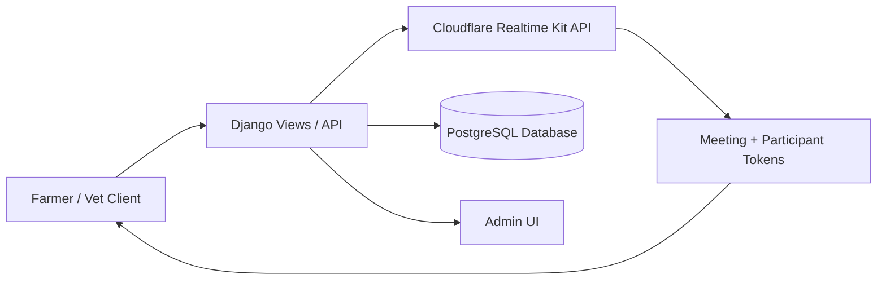

# RealtimeKit-Learning Developer Documentation

This document is the team’s long-term reference for the RealtimeKit-Learning codebase. It is intended for onboarding, maintenance, debugging, and future development.

> Scope note: this repository currently contains a working Django backend with Cloudflare-based meeting creation and join flows. The frontend directory in this workspace is empty, so frontend-specific implementation details are limited and marked as TODO where necessary.

## 1. Project Overview

### What the project does
RealtimeKit-Learning is a veterinary consultation platform that allows a farmer to request help and a veterinarian to join a live video consultation. The current implementation focuses on the backend orchestration layer:

- create a meeting in a real-time video provider,
- generate participant tokens and join links,
- expose routes for farmer/vet flows,
- store request/meeting metadata in the database,
- provide admin tooling for generating links.

### Who it is for
The primary users are:

- Farmers who need to request veterinary assistance.
- Veterinarians who receive requests and join consultations.
- Admins who manage requests and meetings.

### Current implementation status
The repository currently implements the backend workflow and the meeting join experience through Django templates. The frontend application is not present in the workspace at the time of writing, so any frontend-specific documentation is provisional.

### Core technology stack

| Layer | Technology |
| --- | --- |
| Backend | Python, Django 5.2.15 |
| API layer | Django REST Framework 3.15.2 |
| Authentication | Django auth + JWT via djangorestframework-simplejwt |
| Database | PostgreSQL (configured) with Django ORM |
| Media | Django file uploads |
| Real-time integration | Cloudflare Realtime Kit API |
| CORS | django-cors-headers |
| Admin | Django admin |

### High-level architecture
The system is centered around the Django backend. When a farmer request is created or a meeting is generated, the backend talks to Cloudflare to create a meeting and participant tokens, then returns join URLs for the farmer and veterinarian roles.



### Design intent
The implementation uses a small number of domain concepts:

- User: role-based account (farmer, vet, admin)
- Vet: veterinarian profile data
- FarmerRequest: a farmer’s request for help
- Meeting: one meeting generated from a farmer request
- CloudflareRealtimeKit: service wrapper for the Cloudflare API

## 2. Getting Started

### Prerequisites
Install the following before working locally:

- Python 3.10+ (Django 5.2.15 target)
- PostgreSQL server running locally or accessible by hostname
- pip and virtualenv
- Optional: Node.js if the frontend app is later restored or developed in this repo

### Backend environment setup
1. Open a terminal in the repository root.
2. Create and activate a virtual environment:

```bash
cd backend
python -m venv .venv
# Windows
.venv\Scripts\activate
# macOS / Linux
source .venv/bin/activate
```

3. Install dependencies:

```bash
pip install -r requirements.txt
pip install djangorestframework-simplejwt
```

> TODO: The dependency manifest currently lists Django REST Framework and related packages, but it does not explicitly include djangorestframework-simplejwt even though the settings module imports it. Confirm the environment and update the manifest if needed.

4. Create or verify the environment file at [backend/.env](backend/.env). The repository already contains a local env file, but it should be treated as sensitive and not committed with production values.

### Required environment variables
The backend reads configuration from environment variables via Django settings.

| Variable | Required | Purpose |
| --- | --- | --- |
| SECRET_KEY | No | Django secret key |
| DEBUG | No | Enable/disable debug mode |
| ALLOWED_HOSTS | No | Allowed hosts for Django |
| CLOUDFLARE_ACCOUNT_ID | Yes for Cloudflare flows | Cloudflare account identifier |
| CLOUDFLARE_APP_ID | Yes for Cloudflare flows | Cloudflare Realtime app identifier |
| CLOUDFLARE_API_TOKEN | Yes for Cloudflare flows | Cloudflare API bearer token |
| STATIC_API_KEY | Yes for internal routes | Protection for internal endpoints |
| FRONTEND_BASE_URL | Yes for meeting links | Base URL used to build farmer/vet join links |
| DB_NAME | Yes for database connection | PostgreSQL database name |
| DB_USER | Yes for database connection | PostgreSQL username |
| DB_PASSWORD | Yes for database connection | PostgreSQL password |
| DB_HOST | Yes for database connection | PostgreSQL host |
| DB_PORT | Yes for database connection | PostgreSQL port |

Example:

```env
SECRET_KEY=change-me
DEBUG=True
ALLOWED_HOSTS=localhost,127.0.0.1
CLOUDFLARE_ACCOUNT_ID=your-account-id
CLOUDFLARE_APP_ID=your-app-id
CLOUDFLARE_API_TOKEN=your-token
STATIC_API_KEY=your-shared-secret
FRONTEND_BASE_URL=http://localhost:3000
DB_NAME=agrivet_db
DB_USER=postgres
DB_PASSWORD=your-password
DB_HOST=localhost
DB_PORT=5432
```

### Database setup
The project is configured for PostgreSQL in [backend/config/settings.py](backend/config/settings.py). Apply migrations:

```bash
cd backend
python manage.py migrate
```

### Run the backend locally
```bash
cd backend
python manage.py runserver
```

The backend will be available at:

- http://127.0.0.1:8000/
- http://localhost:8000/

### Admin user
Create a Django admin or staff account:

```bash
cd backend
python manage.py createsuperuser
```

## 3. Project Structure

```text
.
├── DOCUMENTATION.md
├── PROJECT_DOCUMENTATION.md
├── backend/
│   ├── .env
│   ├── .gitignore
│   ├── manage.py
│   ├── db.sqlite3
│   ├── requirements.txt
│   ├── api/
│   │   ├── admin.py
│   │   ├── apps.py
│   │   ├── middleware/
│   │   │   └── api_key.py
│   │   ├── migrations/
│   │   ├── models.py
│   │   ├── permissions.py
│   │   ├── serializers.py
│   │   ├── services/
│   │   │   ├── cloudflare.py
│   │   │   └── guest.py
│   │   ├── templates/
│   │   │   └── meeting_join.html
│   │   ├── tests.py
│   │   └── urls.py
│   ├── config/
│   │   ├── asgi.py
│   │   ├── settings.py
│   │   ├── urls.py
│   │   └── wsgi.py
│   ├── media/
│   │   └── cow_images/
│   └── venv/
└── frontend/
    └── (currently empty in this workspace)
```

### Major modules

- [backend/api](backend/api): the application module containing models, views, serializers, permissions, services, routing, middleware, templates, and tests.
- [backend/config](backend/config): Django project configuration, URL routing, WSGI/ASGI setup, and settings.
- [backend/api/services/cloudflare.py](backend/api/services/cloudflare.py): wrapper around the Cloudflare Realtime Kit API.
- [backend/api/middleware/api_key.py](backend/api/middleware/api_key.py): protects internal endpoints with a static shared key.
- [backend/api/templates/meeting_join.html](backend/api/templates/meeting_join.html): browser page that initializes the meeting client with a token from the URL.
- [backend/media](backend/media): uploaded image assets for farmer requests.
- [frontend](frontend): expected frontend application directory, but it is empty in the current workspace.

## 4. Core Concepts & Data Flow

### Core domain model
The backend defines four primary domain concepts:

1. User
   - Django custom user model with `ADMIN`, `VET`, and `FARMER` roles.
   - Stored in [backend/api/models.py](backend/api/models.py).

2. Vet
   - A veterinarian profile linked to a user.
   - Contains specialisation, experience, and availability status.

3. FarmerRequest
   - Represents a farmer’s request for veterinary help.
   - Includes problem description, optional cow image, status, assigned vet, and timestamps.

4. Meeting
   - Represents one generated consultation meeting.
   - Stores the Cloudflare meeting ID and the farmer/vet join links.

### Request lifecycle
A typical request flow looks like this:

1. A farmer creates a request via the farmer request endpoint.
2. A vet is assigned through the admin or future business logic.
3. An admin or API call creates a Cloudflare meeting.
4. The backend creates a participant token for the farmer and a participant token for the vet.
5. The backend returns join URLs that point to the farmer/vet meeting routes.
6. The browser loads the join template and initializes the real-time client with the supplied token.

### Why the current design exists
The code heavily favors pragmatism over over-engineering:

- The service layer isolates Cloudflare API calls in [backend/api/services/cloudflare.py](backend/api/services/cloudflare.py), which makes it easier to change providers later.
- Custom permissions in [backend/api/permissions.py](backend/api/permissions.py) enforce role-based access.
- The middleware in [backend/api/middleware/api_key.py](backend/api/middleware/api_key.py) adds a lightweight protection layer for internal endpoints.
- The model layer is intentionally small and focused on the current workflow; it does not yet implement a full scheduling or case-management system.

### Notable implementation choices
- The project uses a custom user model instead of Django’s default user model, which is appropriate because roles are first-class behavior here.
- The join pages use a token passed in the URL query string rather than a server-side session, which keeps the flow simple but requires careful URL handling.
- The backend is currently the source of truth for meeting creation; the frontend client is only responsible for consuming the token and initializing the meeting experience.

## 5. API / Routes Documentation

### Routing conventions
The API uses a simple, explicit URL style:

- Paths are lowercase and descriptive.
- The main API namespace is prefixed with `/api/`.
- Action-oriented routes use suffixes like `create/` and `list/`.
- Public join routes are separate from the API namespace and live at `/farmer/` and `/vet/`.

### Endpoint reference

| Method | Path | Auth | Purpose | Request body / params | Response |
| --- | --- | --- | --- | --- | --- |
| GET | `/api/health/` | None | Health check | None | JSON with status and message |
| POST | `/api/meeting/create/` | None | Create a meeting and participant tokens | Optional `request_id` | JSON with meeting metadata and farmer/vet tokens and links |
| POST | `/api/auth/login/` | None | Authenticate a user and issue JWT tokens | `username`, `password` | `access`, `refresh`, `role`, `username` |
| POST | `/api/farmer/request/create/` | JWT + farmer role | Create a farmer request | `problem`, `description`, optional `cow_image` | Serialized farmer request |
| GET | `/api/farmer/request/list/` | JWT + farmer role | List requests owned by the current farmer | None | List of farmer requests |
| GET | `/api/vet/request/list/` | JWT + vet role | List requests assigned to the current vet | None | List of assigned requests |
| GET | `/api/internal/meeting/<uuid:meeting_uuid>/` | `X-API-KEY` header | Retrieve basic meeting information for internal use | Path parameter `meeting_uuid` | JSON with meeting metadata |
| POST | `/api/guest/request/` | None | Open a consultation request using only a phone number | `phone`, `problem`, optional `description` | JSON with `success`, `request_id`, `status`, `message` |
| GET | `/api/guest/request/<int:request_id>/` | None | Poll a guest request's status | Path parameter `request_id` | JSON with status, optional `assigned_vet_name` and `farmer_join_link` |
| GET | `/farmer/` | None | Render the farmer join page | Query parameter `token` or `authToken` | HTML template |
| GET | `/vet/` | None | Render the vet join page | Query parameter `token` or `authToken` | HTML template |
| GET | `/admin/` | Django admin auth | Admin interface | None | Admin UI |

### Endpoint details

#### Health check
- Path: `/api/health/`
- Method: `GET`
- Authentication: none
- Returns a simple availability payload.

#### Create meeting
- Path: `/api/meeting/create/`
- Method: `POST`
- Authentication: none in current code
- Behavior:
  - creates a Cloudflare meeting,
  - creates a participant token for the farmer,
  - creates a participant token for the vet,
  - builds join URLs using `FRONTEND_BASE_URL`,
  - saves a meeting record if a request and vet assignment are available.
- Request body:

```json
{
  "request_id": 123
}
```

- Response contains:

```json
{
  "success": true,
  "db_meeting_id": "uuid-or-null",
  "meeting": {
    "id": "cloudflare-meeting-id",
    "title": "Veterinary Consultation",
    "status": "CREATED"
  },
  "farmer": {
    "id": "participant-id",
    "name": "Farmer",
    "token": "token",
    "join_url": "http://localhost:3000/farmer?token=..."
  },
  "vet": {
    "id": "participant-id",
    "name": "Veterinarian",
    "token": "token",
    "join_url": "http://localhost:3000/vet?token=..."
  }
}
```

#### Login
- Path: `/api/auth/login/`
- Method: `POST`
- Authentication: none
- Request:

```json
{
  "username": "farmer1",
  "password": "secret"
}
```

- Response includes JWT bearer tokens and role.

#### Farmer request lifecycle
- Create: `/api/farmer/request/create/`
- List: `/api/farmer/request/list/`
- Auth: JWT + farmer role
- These endpoints use the `FarmerRequestSerializer` and are intended for the farmer workflow.

#### Vet request lifecycle
- List: `/api/vet/request/list/`
- Auth: JWT + vet role
- Returns requests assigned to the current vet profile.

#### Internal meeting endpoint
- Path: `/api/internal/meeting/<uuid:meeting_uuid>/`
- Method: `GET`
- Authentication: shared header key
- Required header:

```http
X-API-KEY: <STATIC_API_KEY>
```

This endpoint is intended for internal automation and should not be treated as a public API.

## 5.1 Guest Mode

Guest Mode lets an anonymous user open a veterinary consultation request using only a phone number. No OTP/SMS verification happens in v1, and vet assignment stays admin-only. Guest requests reuse the existing `User`, `FarmerRequest`, and `Meeting` models — there is no parallel meeting pipeline.

### Phone normalization rule

All guest phone numbers are canonicalized by `api.services.guest.normalize_phone` before being stored or looked up:

- trim surrounding whitespace,
- drop a single leading `+` if present,
- keep only digit characters `0-9`.

The result is the E.164-style digit sequence without the `+` prefix. For example `+880 1712-345678` normalizes to `8801712345678`. Guest numbers must normalize to between 7 and 15 digits, otherwise the API returns a 400.

### Identity behavior

`api.services.guest.find_or_create_farmer_by_phone`:

- normalizes the phone,
- looks up `User` by `phone` (the field is unique in practice),
- if the user exists and is not a `FARMER`, raises a 400 with a clear message (phone numbers owned by VET/ADMIN accounts cannot open guest requests),
- if the user exists as a `FARMER`, returns it,
- otherwise creates a new `User` with `role=FARMER`, `phone` set, `is_active=True`, and a unique username `guest_<phone>` (a numeric suffix is appended if that username is already taken). The new account has no usable password, so it cannot log in — v1 has no OTP flow.

### Endpoint: POST `/api/guest/request/`

- Authentication: none (`AllowAny`)
- Request body:

```json
{
  "phone": "+880 1712-345678",
  "problem": "Cow has fever",
  "description": "Not eating for two days"
}
```

- `phone` (required), `problem` (required, non-empty), `description` (optional)
- Behavior:
  - validates phone and problem,
  - calls `find_or_create_farmer_by_phone`,
  - if the farmer already has an open request in `PENDING` or `ASSIGNED` status, returns that existing request (idempotent) instead of creating a duplicate,
  - otherwise creates `FarmerRequest` with `status=PENDING`, `assigned_vet=None`, `source=GUEST`,
  - never calls Cloudflare and never creates a `Meeting`.
- Response (new request):

```json
{
  "success": true,
  "request_id": 42,
  "status": "PENDING",
  "message": "Request submitted successfully. A veterinarian will be assigned shortly."
}
```

- Error responses:
  - empty/invalid phone or empty problem → 400 with DRF field errors,
  - phone registered to a VET/ADMIN account → 400 with a `detail` message.

### Endpoint: GET `/api/guest/request/<int:request_id>/`

- Authentication: none (`AllowAny`)
- Behavior:
  - loads the `FarmerRequest` by id, 404 if unknown,
  - returns status only while `PENDING` or `ASSIGNED` and no meeting link exists,
  - if a related `Meeting` with a `farmer_link` exists, reports status `MEETING_CREATED` and includes `farmer_join_link` (the vet link is never exposed on this public endpoint).
- Response examples:

```json
{
  "request_id": 42,
  "status": "PENDING",
  "problem": "Cow has fever",
  "message": "Your request is pending. A veterinarian will be assigned soon."
}
```

```json
{
  "request_id": 42,
  "status": "MEETING_CREATED",
  "problem": "Cow has fever",
  "assigned_vet_name": "Dr. Reza",
  "farmer_join_link": "http://localhost:3000/farmer?token=abc",
  "message": "A veterinarian is ready. Join the consultation using the link."
}
```

### Guest request lifecycle

1. Guest POSTs to `/api/guest/request/` → farmer is found/created, request is `PENDING`.
2. Admin assigns an available vet on the request (existing admin flow).
3. Admin runs the existing “Generate Meeting & Video Call Links” action, which creates the Cloudflare meeting, stores `farmer_link`/`vet_link`, and moves the request to `MEETING_CREATED`.
4. Guest GETs `/api/guest/request/<id>/` and receives `farmer_join_link` once step 3 has happened.

### Edge case matrix

| Case | Result |
| --- | --- |
| Empty or invalid phone | 400 |
| Phone belongs to VET/ADMIN | 400 with clear `detail` message |
| Duplicate open request (PENDING/ASSIGNED) | Returns the existing request |
| GET before vet assignment | `status=PENDING`, no join link |
| GET after assignment, before link generation | `status=ASSIGNED`, no join link |
| GET after link generation | `status=MEETING_CREATED` + `farmer_join_link` |
| Unknown `request_id` | 404 |
| Cloudflare meeting on guest POST | Never called |

### Admin filtering

Guest-created requests are tagged `source=GUEST` on `FarmerRequest` and shown in the Django admin (`source` column and list filter), so admins can distinguish walk-in/phone requests from portal requests.

### Out of scope (v1)

- OTP / SMS verification
- Auto-assigning an `AVAILABLE` vet
- Changing `CloudflareRealtimeKit` / the meeting generation flow
- Building a guest-facing frontend
- Returning the vet join link on the public guest GET

## 6. Known Issues & Fixes Log

### Gotcha: URL mismatch between backend-generated links and the intended frontend host
This is the most important operational issue to be aware of when working on this codebase.

#### What caused it
Meeting join URLs are built by the backend using `FRONTEND_BASE_URL` in [backend/config/settings.py](backend/config/settings.py) and the meeting creation flow in [backend/api/views.py](backend/api/views.py). If that setting points to the wrong environment, the generated links will route users to the wrong host.

This commonly happens when:

- the backend is tested locally but `FRONTEND_BASE_URL` still points to a production hostname,
- the frontend is served on a different port or host than expected,
- the backend and frontend are deployed to different environments without environment-specific configuration.

#### How it was diagnosed
The issue is usually visible by inspecting the response from `/api/meeting/create/` and checking the `farmer.join_url` and `vet.join_url` values. If they point to the wrong domain, the problem is not the meeting token generation itself; the problem is the base URL configuration.

Other symptoms include:

- the join page loads but the browser redirects to the wrong app host,
- the generated link opens a site that does not match the local development environment,
- the frontend fails to load because the browser is pointed at an unexpected origin.

#### How it was fixed
The fix is to verify and set `FRONTEND_BASE_URL` to the correct host for the current environment before creating meeting links. In practice:

1. confirm the intended frontend base URL,
2. update the backend environment variables,
3. restart the Django process,
4. test the meeting creation flow again and verify the join URLs point to the correct frontend host.

#### General rule for future contributors
Always verify the following when changing routing or deployment configuration:

- `FRONTEND_BASE_URL` in the backend environment,
- the frontend origin you are actually running locally or deploying,
- any CORS rules for the origin,
- the actual route the join links should target.

> TODO: establish a formal environment mapping (local, staging, production) so this configuration is less error-prone.

### Additional operational gotchas
- The project is configured for PostgreSQL, but the repository also contains [backend/db.sqlite3](backend/db.sqlite3). This mismatch should be clarified before relying on local data.
- The Django template route uses query parameter tokens. If a link omits `token` or `authToken`, the join page will render an error message.
- The internal meeting endpoint requires the shared API key; requests without the correct value will fail with a 401 response.

## 7. Coding Conventions & Standards

### Python style
The codebase follows standard Django/DRF conventions:

- use clear, descriptive function and variable names,
- keep views focused and delegate external actions to services,
- use model/service layers rather than putting provider logic directly in views whenever practical,
- keep comments meaningful and explain non-obvious behavior.

### File organization rules
- Keep Django app logic inside [backend/api](backend/api).
- Put provider integrations in a dedicated service module under [backend/api/services](backend/api/services).
- Keep middleware in [backend/api/middleware](backend/api/middleware).
- Keep reusable UI markup in [backend/api/templates](backend/api/templates).

### Naming conventions
- Django app module: lowercase, descriptive names like `api`.
- Models: PascalCase class names (`FarmerRequest`, `Meeting`, `Vet`).
- Views/functions: snake_case (`create_meeting`, `health_check`).
- URL names: lowercase with underscores (`farmer_request_create`).

### Formatting and linting
No explicit formatter or lint config is present in the backend manifest at the time of writing. The team should adopt a standard such as:

- Ruff for linting,
- Black for formatting,
- pytest or Django test cases for tests.

> TODO: add project-level formatting and linting configuration to the repository.

### Commit message guidance
Use concise, descriptive commit messages. A practical format is:

```text
<type>(<scope>): <summary>
```

Examples:

```text
feat(api): add farmer request creation endpoint
fix(urls): correct frontend base URL handling
chore(deps): update Django and DRF requirements
```

## 8. Testing

### Current test status
The repository currently contains a placeholder test module at [backend/api/tests.py](backend/api/tests.py). There is no meaningful automated coverage yet.

### What to test
The most important areas to cover are:

- meeting creation flow,
- permission enforcement for farmer/vet endpoints,
- login success and failure,
- meeting link generation,
- internal endpoint authentication.

### Running tests
From the backend directory:

```bash
cd backend
python manage.py test
```

### How to add new tests
Prefer Django test cases for backend behavior:

```python
from django.test import TestCase

class MeetingFlowTests(TestCase):
    def test_health_check(self):
        response = self.client.get('/api/health/')
        self.assertEqual(response.status_code, 200)
```

### Recommendation
Introduce targeted tests before changing routing, auth, or meeting creation logic. This project is highly sensitive to environment configuration, so regression tests are especially valuable.

> TODO: add a proper test suite and CI-friendly execution workflow.

## 9. Deployment

### Current deployment posture
The repository does not currently include deployment manifests, containerization, CI/CD pipelines, or environment-specific deployment recipes. The backend is a standard Django application and is expected to be deployed through a server environment that can run Python and PostgreSQL.

### Build and runtime process
At minimum, deployment should include:

1. installing Python dependencies,
2. setting environment variables,
3. running database migrations,
4. starting the Django application with a production-grade WSGI server.

Example:

```bash
cd backend
pip install -r requirements.txt
python manage.py migrate
python manage.py collectstatic --noinput
```

### Environments
No formal staging or production environment layout is defined in the repository yet.

- Local: used for development and debugging.
- Staging: TODO: define separately.
- Production: TODO: define separately.

### Rollback procedure
No rollback procedure is documented in the repository. For production use, define:

- how to revert to the previous deployed build,
- how to restore database state if needed,
- how to switch environment variables back safely.

> TODO: formalize staging/production deployment and rollback instructions.

## 10. Troubleshooting

### Problem: Django import or dependency errors
Symptoms:
- `ModuleNotFoundError`
- missing package errors on startup

Resolution:
- activate the virtual environment,
- reinstall dependencies from [backend/requirements.txt](backend/requirements.txt),
- confirm optional packages such as `djangorestframework-simplejwt` are installed.

### Problem: database connection errors
Symptoms:
- PostgreSQL connection refused,
- authentication failed,
- invalid database name.

Resolution:
- confirm the PostgreSQL server is running,
- verify `DB_*` environment variables,
- ensure the target database exists.

### Problem: Cloudflare API errors
Symptoms:
- request returns 4xx/5xx from the Cloudflare service,
- meeting creation fails.

Resolution:
- verify `CLOUDFLARE_ACCOUNT_ID`, `CLOUDFLARE_APP_ID`, and `CLOUDFLARE_API_TOKEN`,
- confirm the token has permission for the requested operation,
- inspect the response body for the provider’s error message.

### Problem: join page says “No token found”
Symptoms:
- `/farmer/` or `/vet/` renders an error message.

Resolution:
- ensure the meeting link includes `token` or `authToken` in the query string,
- verify the backend created the participant token successfully.

### Problem: generated links point to the wrong host
Symptoms:
- local links direct to production or a different environment,
- open pages are not the expected application instance.

Resolution:
- check `FRONTEND_BASE_URL`,
- verify the correct environment configuration is loaded,
- restart the Django process after changing the value.

## 11. Contribution Guidelines

### Branch strategy
Use short-lived branches for isolated work:

- `feature/<short-name>` for new functionality
- `fix/<short-name>` for bug fixes
- `chore/<short-name>` for maintenance and tooling

> TODO: confirm the repository’s default branch and any branch protection rules.

### Pull request process
1. Create a branch from the main development branch.
2. Make focused changes with clear commit messages.
3. Run relevant tests and verify the behavior locally.
4. Open a pull request with:
   - summary of changes,
   - testing evidence,
   - any environment or deployment notes.

### Code review expectations
Reviewers should check:

- correctness and maintainability,
- security concerns (especially around auth and external API calls),
- environment variable handling,
- route/auth behavior,
- documentation updates for user-facing or architectural changes.

### Documentation expectation
Whenever a feature changes behavior, configuration, or routes, update the relevant documentation in this file or in the docs directory.

---

## Summary
This codebase is currently a backend-led meeting orchestration service for veterinary consultations. The most important implementation points to remember are:

- the system is driven by Django and Cloudflare Realtime Kit,
- meeting links are built from `FRONTEND_BASE_URL`,
- role-based access is enforced through custom permissions,
- the current repository still needs more formal testing, deployment, and environment documentation.

If you are contributing to this project, start from the backend flow in [backend/api/views.py](backend/api/views.py), then verify the route and environment configuration in [backend/config/settings.py](backend/config/settings.py) and [backend/.env](backend/.env).
